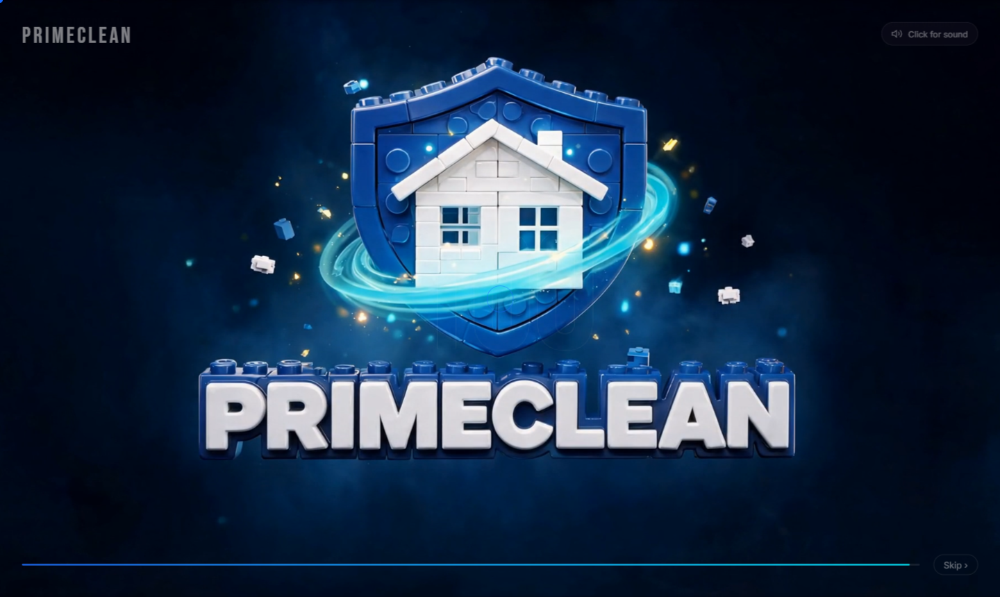
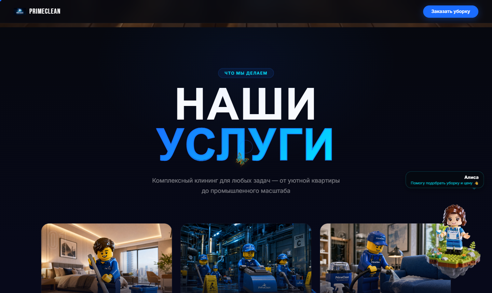
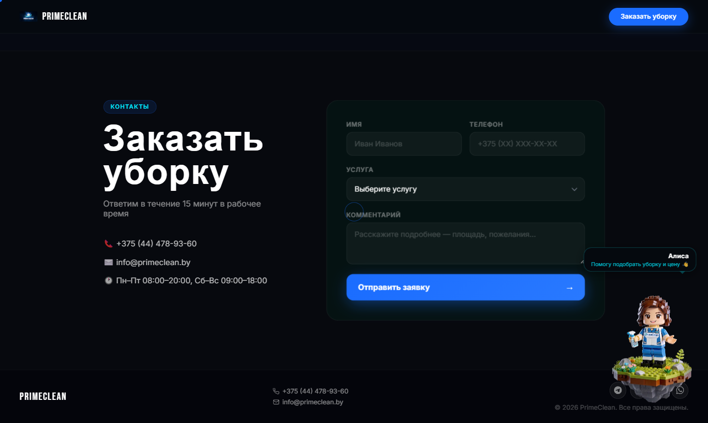

# PrimeClean — Клининговый сервис Беларуси

<div align="center">



**Чистота без компромиссов**

[](https://developer.mozilla.org/en-US/docs/Web/HTML)
[](https://developer.mozilla.org/en-US/docs/Web/CSS)
[](https://developer.mozilla.org/en-US/docs/Web/JavaScript)
[](https://nodejs.org/)
[](https://expressjs.com/)
[](https://www.sqlite.org/)
[](https://www.deepseek.com/)

</div>

---

## О проекте

PrimeClean — это лендинг клининговой компании из Беларуси с продающим дизайном, WOW‑анимациями и встроенным AI‑ассистентом. Сайт построен на ванильном стеке (HTML/CSS/JS) без фреймворков, что обеспечивает максимальную скорость загрузки.

### Ключевые особенности

- **AI-ассистент «Алиса»** — LEGO-персонаж в правом нижнем углу, общается с клиентами через DeepSeek API, знает актуальные цены и может сразу заполнить форму заявки
- **Cinematic hero-секция** — полноэкранное видео с параллакс-эффектом и анимированным логотипом
- **Бабочки на Canvas** — анимированные PNG-спрайты (Higgsfield) равномерно распределяются по секции услуг и прячутся под карточки
- **Scroll-кинематика** — покадровая анимация Higgsfield синхронизирована с прокруткой страницы
- **Glassmorphism UI** — чат-панель ассистента с glass-blur эффектом
- **Голосовой ввод** — Web Speech API для диктовки сообщений ассистенту
- **Telegram + SQLite** — backend сохраняет заявки и отправляет уведомления в Telegram

---

## Скриншоты

<table>
  <tr>
    <td></td>
    <td></td>
  </tr>
  <tr>
    <td align="center"><em>Hero-секция с Higgsfield-видео</em></td>
    <td align="center"><em>Услуги с Canvas-бабочками и AI-ассистентом</em></td>
  </tr>
  <tr>
    <td colspan="2"></td>
  </tr>
  <tr>
    <td colspan="2" align="center"><em>Форма заявки + AI-ассистент «Алиса»</em></td>
  </tr>
</table>

---

## Стек технологий

### Frontend
| Технология | Применение |
|---|---|
| Vanilla JS (ES2022) | Вся логика без фреймворков |
| CSS3 + Custom Properties | Анимации, glassmorphism, адаптив |
| Canvas 2D API | Система бабочек (dual-layer) |
| Web Speech API | Голосовой ввод в чат |
| WebM + прозрачность | Анимации AI-ассистента |
| IntersectionObserver | Scroll-триггеры и видимость виджета |
| Vercel | Деплой фронтенда |

### Backend
| Технология | Применение |
|---|---|
| Node.js + Express | REST API сервер |
| SQLite (better-sqlite3) | Хранение заявок |
| DeepSeek API | AI-ответы ассистента |
| Telegram Bot API | Уведомления о новых заявках |
| Railway | Деплой бэкенда |
| Docker | Контейнеризация |

### AI & Media
| Инструмент | Применение |
|---|---|
| DeepSeek `deepseek-chat` | Языковая модель ассистента |
| Higgsfield AI | Cinematic видео и спрайты бабочек |
| WebM с alpha-каналом | Прозрачные анимации персонажа |

---

## Структура проекта

```
PrimeCleanV2/
├── frontend/
│   ├── index.html          # Единая страница (SPA-like)
│   ├── style.css           # Все стили (~1400+ строк)
│   ├── app.js              # Вся логика (~900+ строк)
│   ├── serve.json          # Конфиг для локального сервера
│   ├── vercel.config.json  # Деплой на Vercel
│   └── motion/
│       ├── image/          # Изображения карточек услуг
│       └── ai_agent/       # WebM-анимации и PNG персонажа
├── backend/
│   ├── src/
│   │   └── server.js       # Express API: /api/lead, /api/chat
│   ├── .env.example        # Шаблон переменных окружения
│   ├── package.json
│   └── railway.toml        # Конфиг Railway деплоя
├── docker-compose.yml
└── docs/
    └── screenshots/        # Скриншоты для README
```

---

## Локальный запуск

### Frontend
```bash
# Любой статический сервер, например:
npx serve frontend
# Откройте http://localhost:3000
```

### Backend
```bash
cd backend
cp .env.example .env
# Заполните .env своими ключами

npm install
npm run dev
# API доступен на http://localhost:3001
```

### Переменные окружения (backend/.env)
```env
PORT=3001
DEEPSEEK_API_KEY=sk-...
TELEGRAM_BOT_TOKEN=...
TELEGRAM_CHAT_ID=...
```

---

## AI-ассистент «Алиса»

LEGO-девочка в правом нижнем углу — полноценный AI-консультант:

- Знает актуальные цены на все услуги (BYN)
- Проверяет реалистичность введённых данных (площадь vs количество окон)
- Может голосом принять заказ и сразу заполнить форму
- Анимации: idle (покачивание) → greeting (приветствие) → talking (ответ)
- Голосовой ввод через Web Speech API (Chrome/Edge)

---

## Услуги

| Услуга | Цена от |
|---|---|
| Уборка квартир | 80 BYN (2 BYN/м²) |
| Клининг офисов | 180 BYN (1.8 BYN/м²) |
| Генеральная уборка | 240 BYN (6 BYN/м²) |
| Уборка после ремонта | 360 BYN (9 BYN/м²) |
| Уборка домов | 180 BYN |
| Химчистка мебели | 18 BYN/м² |

---

## Контакты

- Телефон: **+375 (44) 478-93-60**
- Email: **info@primeclean.by**
- Telegram: **@primeclean_by**
- Режим работы: Пн–Пт 08:00–20:00, Сб–Вс 09:00–18:00

---

<div align="center">
  <sub>© 2026 PrimeClean. Все права защищены.</sub>
</div>
